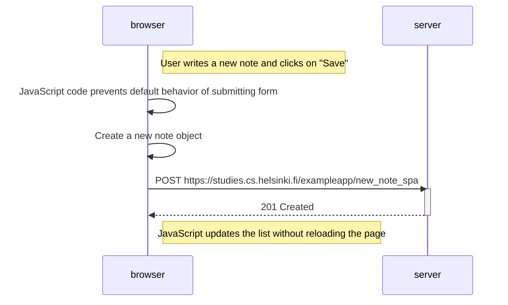

```mermaid
sequenceDiagram
    participant browser
    participant server
    
    Note right of browser: User writes a new note and clicks on "Save"
    browser->>browser: JavaScript code prevents default behavior of submitting form
    browser->>browser: Create a new note object
    
    browser->>server: POST https://studies.cs.helsinki.fi/exampleapp/new_note_spa
    activate server
    server-->>browser: 201 Created
    deactivate server

    Note right of browser: JavaScript updates the list without reloading the page
```